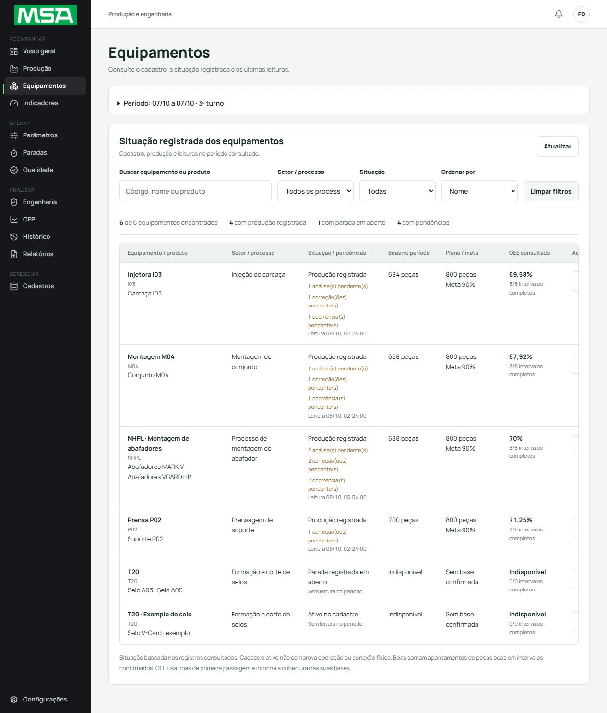
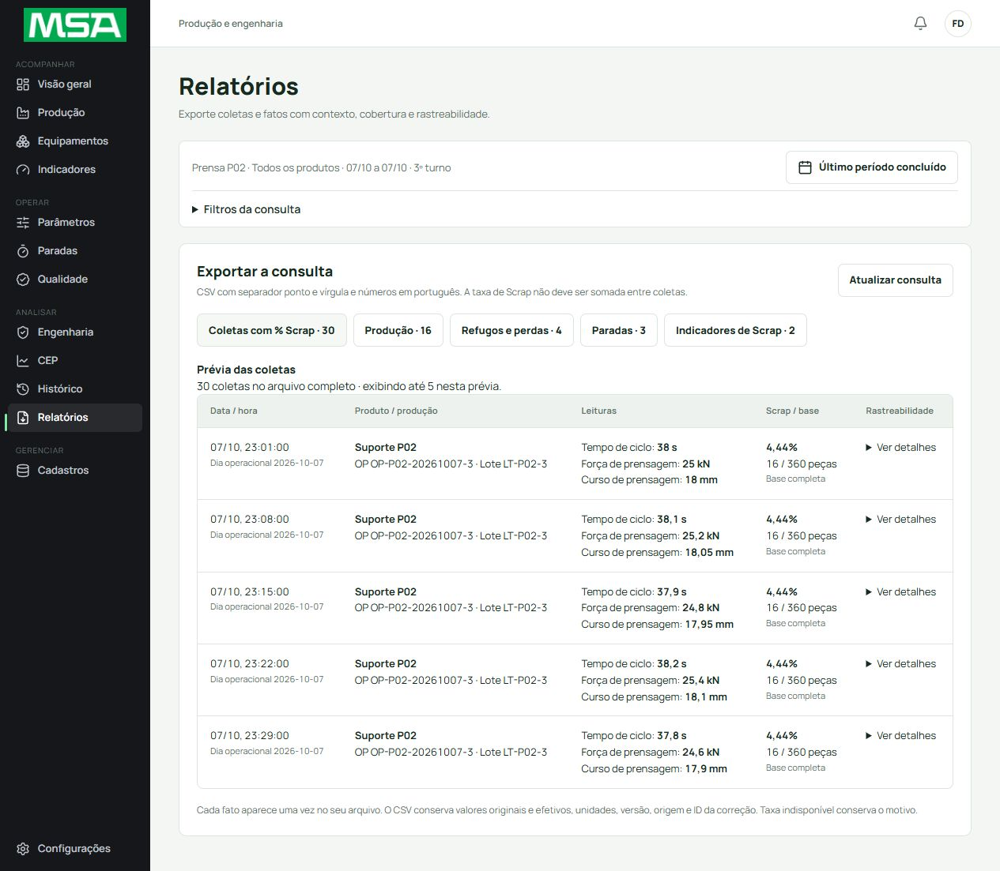

# Entrega da extensão para avaliação — 08/10/2026

Concluída no checkout `C:\Users\Kauan\.codex\worktrees\msa-jornada-coesa\Desafio de Ideias`, branch `codex/msa-jornada-coesa`. Código final `1b42cc8`. Teste local: http://127.0.0.1:5180/msa/ (atualizar com Ctrl+F5). As cópias Desktop/Documents não foram substituídas. Nenhum push, merge ou novo deploy do GitHub Pages foi feito; o aplicativo conserva rotas hash e recursos relativos.

## Interface

- Busca de produção por produto, OP, lote e turno normaliza acentos, espaços e termos. Conferência no navegador: `3º turno` encontrou 26/55 produções; `LT-AVALIACAO-P02` encontrou exatamente uma, selecionada com o contexto correto.
- Equipamentos apresenta filtros por equipamento/produto, processo e situação, ordenação, contagens, peças boas, plano/meta, OEE com cobertura e detalhes com acesso contextual. Identidade visual MSA preservada; sem mapa da planta.
- Prévia dos relatórios mostra data/hora, produto/OP/lote, leituras com unidades e Scrap/base; rastreabilidade longa fica nos detalhes. CSV mantém dados originais/efetivos e origem.
- O cartão de registro aparece nas páginas operacionais pertinentes; não aparece em Visão geral, Relatórios, Cadastros ou Configurações. Filtros de consulta continuam onde necessários.
- Cp/Cpk permanecem disponíveis como já estavam; não foram removidos, recalculados artificialmente ou alterados nesta extensão.

## Dados efetivamente publicados

Manifesto `presentation_20261008_v1_rev_evaluation`: cinco análises (duas aguardando, duas em análise e uma aprovada), cinco solicitações de correção aguardando outro responsável, cinco ocorrências (incluindo uma resolvida), três produções adicionais P02/I03/M04, seis paradas encerradas e bases reconciliadas de planejamento, produção, inspeção, perdas e confiabilidade. Os exemplos preservam sua origem no histórico e nas exportações; não comprovam integração física ou homologação industrial.

Publicação retomada sem apagar os quatro registros já gravados: 121 novos registros nesta execução, dez transições e quatro existentes. Total de 2.478 entradas conferidas em segunda sessão autenticada da mesma conta. Repetição criou zero registros. As 2.353 entradas herdadas, membros e dados externos ao pacote foram preservados. Evidência sanitizada: [avaliacao-cloud-publicada.json](evidencias/jornada-coesa/avaliacao-cloud-publicada.json). Backups/envelopes completos permanecem privados e fora do Git.

Conferência visual no período 07/10, turno 3: P02 700 boas / 800 planejadas / OEE 71,25%; I03 684 / 800 / 69,58%; M04 668 / 800 / 67,92%; NHPL 688 / 800 / 70%. Cobertura de oito intervalos em cada linha. Filtro `carcaça` deixa apenas I03. Engenharia mostra análise aprovada P02, correção pendente e ocorrência resolvida; Paradas mostra falha reparada e microparada adicionais, MTBF 230 min e MTTR 8 min no período P02.

CSV de coletas P02 baixado novamente pelo navegador: 30 linhas, três parâmetros com unidades, Scrap `complete`, 16 rejeitadas / 360 brutas = 4,444444444444445%. A nova produção tem OP/lote próprios; não modifica o denominador das coletas anteriores.

## Validação e reparos finais

Suíte completa no código da extensão antes dos dois reparos focais: 265/265 unitários e 25/25 emulador. Após reparo de variantes: 26/26 emulador. Após reparo de relógios/repreparo: 4/4 unitários focais e 2/2 SDK/emulador, incluindo interrupção/retomada, histórico imutável, adulterações e repetição. Estático: 118 arquivos sem erros. Revisões independentes de UI, dados e reparos aprovadas, sem Critical/Important pendentes. Não confundir as suítes anteriores com nova execução integral após o último reparo.

O Firebase real revelou dois problemas que o fluxo de exemplos precisava atravessar: o contrato das análises não aceitava a variante já existente na coleta; e o relógio de auditoria resolvido pelo servidor divergia do placeholder da prévia. O primeiro foi corrigido com validação exata da variante e imutabilidade, mantendo permissões. O segundo preserva eventos históricos persistidos e normaliza somente relógios de análises para o digest. O repreparo usa baseline e comandos originais, preserva hashes herdados e recusa migrar manifesto já publicado. Regras efetivas conferidas com hash `2742c64f347dcda599eb8f6c2696e35501f19141772db73e2694bb559273ce8f`.

## Decisões preservadas

Adicionar casos no trecho disponível do turno, em vez de reescrever produções seladas, preserva os exemplos anteriores; custo: o período agora agrega duas OPs por máquina adicional. Correções permanecem pendentes porque o autor não pode aprová-las; custo: aprovação exige outro responsável legítimo. Relógios são normalizados somente na auditoria das análises; custo: versões não publicadas exigem repreparo privado, sem remapear manifests publicados. Dados históricos sem base continuam explicitamente indisponíveis; exemplos completos estão nas máquinas e períodos acima.

## Evidências visuais

